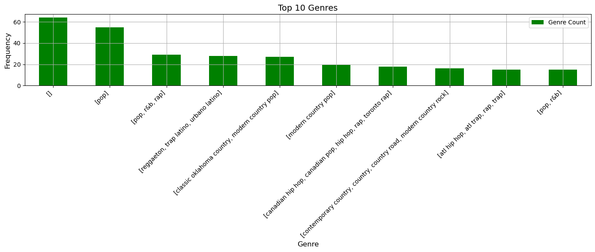

[](https://classroom.github.com/a/6ebMFVGY)
# IE 555 Project Proposal


## Team Members:  
Devang Shinde, devangat@buffalo.edu

Shriram Madkar, shrirams@buffalo.edu 

Gulshankumar Gupta, gulshank@buffalo.edu

Pushkraj Rane, pushkraj@buffalo.edu 


## Proposed Project Title

Data analysis and exploration of Spotify API data


## Project Type
Option 2 - Online Data Analysis

Option 2 - Online Data Analysis

> Students may develop their own programming project. In this option, students must identify a source of online data, which will be dynamically imported via Python. The Python code must utilize these data to either make decision support recommendations or provide a detailed analysis of the data. A YouTube video describing the mechanics of the Python code will be required, in addition to a “how-to” guide for running the code. All source code must be submitted, and the course instructor must be able to execute the code without errors.


## Data Sources

•	Spotify API is used as a data source.

•	The Spotify API (Application Programming Interface) allows developers to access data from the Spotify music streaming service, and build applications that can interact with Spotify's music catalog, user data, and playlists.

•	To use the Spotify API, we need to register our application with Spotify and obtain an access token, which is required to authenticate API requests. The access token must be included in the header of every API request, along with other parameters

•	Here is the link to the Spotify API documentation: https://developer.spotify.com/documentation/web-api 

•	After creating a spotify account or logging into an existing one, the user can create an API documentation and receive unique Developer’s credentials : Client_id and Secret_id, which will be used to fetch and import data.


## Analysis Plan

The objective of this project is to develop a recommendation system for Spotify tracks based on user preferences, such as artist ID, genre, and track ID, using the Spotify API. 

We will also explore the relationships between different music features and track popularity and create visualizations to help understand the data better. 

Once we have imported the Spotify data into our Python environment and installed necessary packages, our first step will be to pre-process the data.

This includes treating/checking for any missing values and removing unnecessary data to ensure accurate analysis.

We will then move on to data exploration and visualization, utilizing Python's data analysis libraries to gain insights into the data.

Through data visualization, we can identify patterns and trends within the Spotify data, such as the relationship between different variables like - artist popularity and genre preference.


## Motivation

The motivation for this project is to create a recommendation system that suggests tracks based on user preferences and gain insights into what makes a track popular, informing music production decisions. From a technical perspective, the project provides an opportunity to explore data analysis, including data visualization, feature engineering, and classification by working on real world data.  This will also provide valuable experience in data wrangling and working with web-based data sources, which are in high demand in many industries.


## Task List
| ID | Task Description | Due Date | Status |
| --- | --- | --- | --- |
| 1 | Update this table with detailed list of tasks | 2023-05-08 | DONE |
| 2 | Acquiring Spotify API Credentials - Acquiring API key and installing Spotify library  | 2023-04-16 | DONE |
| 3 | Importing required data - Retrieving information on the 1000 most popular songs from 2022, including artist name, track name, track popularity, artist id, and track id, etc in a data frame  | 2023-04-22 | DONE |
| 4 | Feature selection - Selecting and retrieving audio features for created data frame ( track_df ) using the API data  | 2023-04-23 | DONE |
| 5 | Data Preprocessing - Performing some data cleaning and manipulation, including dropping unnecessary columns, changing data types and sorting  | 2023-04-30 | DONE |
| 6 | Data Visualization - Performing some exploratory data analysis on the data, including creating bar charts and heatmaps to visualize the data  | 2023-05-06 | IN PROGRESS |
| 7 | Model Development - Create “sp.recommendations” to generate a list of recommended tracks based on set of input parameters | 2023-05-12 | PENDING |
| 8 | Complete YouTube video and upload to YouTube | 2023-05-16 | PENDING |
| 9 | Upload README.md document to Github | 2023-05-17 | PENDING |


## Introduction

The Spotify app is a popular music streaming platform that provides users with access to a vast library of songs from various genres and artists. One of the key features of Spotify is its ability to generate personalized track recommendations for its users. These recommendations are tailored to individual preferences, ensuring that users discover new music that aligns with their tastes.

The data being processed is structured data in tabular form, represented as a pandas DataFrame. It contains columns such as 'track_popularity', 'track_name', 'artist_name', 'art_genre_data', and 'track_id', among others.
The extracted data includes categorical information, such as genres and artist names, as well as numerical data, such as track popularity scores and other track features like danceability, energy, speechiness, acousticness, and liveness.

This code uses Spotipy, a Python library for the Spotify Web API, to gather and analyze data about music tracks and artists on Spotify. It retrieves track and artist information, extracts audio features, analyzes the data, and generates track recommendations. It provides insights into popular tracks and artists, explores audio feature distribution and correlation, and allows for personalized track recommendations.

The primary objective of this code is to generate track recommendations on Spotify and Data Visualization analyzing various data points related to tracks, artists, and user behaviours. 

The code serves as an illustrative example by showcasing the retrieval of track and artist information, extraction of audio features, analysis of the collected data, and generation of personalized track recommendations. 


## References

The following data source was used:

The code uses the Spotipy library and Spotify Web API to retrieve data from Spotify. It authenticates with Spotify, searches for tracks released in a specific year, and fetches track details, artist information, and audio features. 

Here is the link to the [Spotify Web API](https://developer.spotify.com/documentation/web-api)

The link to the feature description is given on the [Spotify Developer page](https://developer.spotify.com/documentation/web-api/reference/get-audio-features)

## Requirements

In this section, provide detailed instructions for installing any necessary pre-requisites. This could include:
Python packages/libraries

* Spotipy package
* Pandas
* Seaborn
* Matplotlib
 
There are certain Keys required to access data via the **Spotify API**:

**Keys** are given below:

- client_id='2e4f244eba6241b494d132cdbfd48c38' 
- client_secret='571067cb29a84ee29539c8fa8bc0fd11'

## Explanation of the Code

## 1. Install  Spotify data using client id and key
```
get_ipython().system('pip install spotipy') 

import spotipy
from spotipy.oauth2 import SpotifyClientCredentials
client_credentials_manager = SpotifyClientCredentials(client_id='2e4f244eba6241b494d132cdbfd48c38', client_secret='571067cb29a84ee29539c8fa8bc0fd11')
sp = spotipy.Spotify(client_credentials_manager=client_credentials_manager)
```
## 2. Import songs data for year 2022 

```
artist_name = []
track_name = []
track_popularity = []
artist_id = []
track_id = []
for i in range(0,1000,50): 
    track_results = sp.search(q='year:2022', type='track', limit=50,offset=i)
    for i, t in enumerate(track_results['tracks']['items']):
        artist_name.append(t['artists'][0]['name'])
        artist_id.append(t['artists'][0]['id'])
        track_name.append(t['name'])
        track_id.append(t['id'])
        track_popularity.append(t['popularity'])
```

## 3. Create dataframe

# In[3]:

```
import pandas as pd
track_data = pd.DataFrame({'artist_name' : artist_name, 'track_name' : track_name, 'track_id' : track_id, 'track_popularity' : track_popularity, 'artist_id' : artist_id})
print(track_data.shape)
track_data.head()
```

# In[4]:

```
art_pop_data = []
art_genre_data = []
art_followers_data = []
for a_id in track_data.artist_id:
  artist = sp.artist(a_id)
  art_pop_data.append(artist['popularity'])
  art_genre_data.append(artist['genres'])
  art_followers_data.append(artist['followers']['total'])
```

# In[5]:

```
track_data = track_data.assign(art_pop_data=art_pop_data, art_genre_data=art_genre_data, art_followers_data=art_followers_data)
track_data.head()
```

## 4. Create dataframe for all audio features

# In[6]:

```
feature_data = []
for t_id in track_data['track_id']:
  af = sp.audio_features(t_id)
  feature_data.append(af)

data = pd.DataFrame(columns=['danceability', 'energy', 'key', 'loudness', 'mode', 'speechiness', 'acousticness',
                             'instrumentalness', 'liveness', 'valence', 'tempo', 'type', 'id', 'uri',
                             'track_href', 'analysis_url', 'duration_ms', 'time_signature'])

for item in feature_data:
  for feat in item:
    data = pd.concat([data, pd.DataFrame(feat, index=[0])], ignore_index=True)

data.head()
```

## 5. Data preprocessing - Dropping unnecessary columns

# In[7]:

```
col_data2 = ['key','mode','type', 'uri','track_href','analysis_url']
data = data.drop(columns=col_data2)
print(track_data.info())
print(data.info())
```

## 6. Datatype modification - convert required data into numeric

# In[8]:
```
track_data['artist_name'] = track_data['artist_name'].astype("string")
track_data['track_name'] = track_data['track_name'].astype("string")
track_data['track_id'] = track_data['track_id'].astype("string")
track_data['artist_id'] = track_data['artist_id'].astype("string")
data['duration_ms'] = pd.to_numeric(data['duration_ms'])
data['instrumentalness'] = pd.to_numeric(data['instrumentalness'])
data['time_signature'] = data['time_signature'].astype("category")
print(track_data.info())
print(data.info())
```

# In[9]:

```
track_data.sort_values(by=['track_popularity'], ascending=False)[['track_name', 'artist_name']].head(20)
```

## 7. Sorting data based on artists follower data

# In[10]:
```
sort_data = pd.DataFrame(track_data.sort_values(by=['art_followers_data'], ascending=False)[['art_followers_data','art_pop_data', 'artist_name','art_genre_data']])
sort_data.astype(str).drop_duplicates().head(20)
```

## 8. Create function for genre

# In[11]:
```
def to_1D(series):
 return pd.Series([x for _list in series for x in _list])
to_1D(track_data['art_genre_data']).value_counts().head(20)
```

## 9. Data Visualization

# In[12]:
```
import matplotlib.pyplot as plt

# Top N genres to display
top_n = 10
fig, ax = plt.subplots(figsize=(14, 6))
genre_counts = track_data['art_genre_data'].value_counts()[:top_n]
genre_counts.plot(kind='bar', ax=ax, color='green', grid=True)
ax.set_xlabel('Genre', size=12)
ax.set_ylabel('Frequency', size=12)
ax.set_title('Top {} Genres'.format(top_n), size=14)
plt.xticks(rotation=45, ha='right')
ax.legend(['Genre Count'])
plt.tight_layout()
plt.show()
```

# In[13]:

```
# Bar Plot: Track Popularity

plt.figure(figsize=(12, 6))
plt.bar(track_data['track_name'][:10], track_data['track_popularity'][:10])
plt.xlabel('Track Name')
plt.ylabel('Popularity')
plt.title('Top 10 Tracks by Popularity')
plt.xticks(rotation=45)
plt.show()
```

# In[14]:
```
#Histogram: Track Popularity Distribution
import matplotlib.pyplot as plt

# Set up the figure and axes
fig, ax = plt.subplots(figsize=(10, 6))

# Plot the histogram
ax.hist(track_data['track_popularity'], bins=20, edgecolor='black')

# Customize the appearance
ax.set_xlabel('Popularity')
ax.set_ylabel('Frequency')
ax.set_title('Track Popularity Distribution')

# Add gridlines
ax.grid(True, linestyle='--', alpha=0.5)

# Add a vertical line for the mean
mean_popularity = track_data['track_popularity'].mean()
ax.axvline(mean_popularity, color='red', linestyle='--', label='Mean Popularity')
ax.legend()

# Add text annotation for the mean
ax.annotate(f'Mean: {mean_popularity:.2f}', xy=(mean_popularity, ax.get_ylim()[1]),
             xytext=(10, -10), textcoords='offset points', color='red')

# Show the plot
plt.tight_layout()
plt.show()
```

# In[15]:

```
#Pie chart

top_genres = to_1D(track_data['art_genre_data']).value_counts().head(5)
plt.figure(figsize=(8, 8))
plt.pie(top_genres, labels=top_genres.index, autopct='%1.1f%%', startangle=90)
plt.title('Top Genres')
plt.axis('equal')
plt.show()
```

# In[16]:

```
#Box Plot: Audio Features Comparison
feature_cols = ['danceability', 'energy', 'speechiness', 'acousticness', 'instrumentalness', 'liveness', 'valence']
plt.figure(figsize=(12, 6))
data[feature_cols].boxplot()
plt.title('Audio Features Comparison')
plt.ylabel('Value')
plt.xticks(rotation=45)
plt.show()
```

# In[17]:

```
#Heatmap

import seaborn as sns

plt.figure(figsize=(10, 8))
sns.heatmap(data.corr(), annot=True, cmap='coolwarm')
plt.title('Correlation Matrix')
plt.show()
```

# In[18]:

```
top10_genre_data = list(to_1D(track_data['art_genre_data']).value_counts().index[:20])
art_bygenre_data = []
for genre in top10_genre_data:
  for index, row in sort_data.iterrows():
    if genre in row['art_genre_data']:
      art_bygenre_data.append({'artist_name':row['artist_name'], 'artist_genre':genre})
      break
pd.json_normalize(art_bygenre_data)
```

## 10. Sorting data by track popularity data

# In[19]:

```
by_track_pop = pd.DataFrame(track_data.sort_values(by=['track_popularity'], ascending=False)[['track_popularity','track_name', 'artist_name','art_genre_data', 'track_id']])
by_track_pop.astype(str).drop_duplicates().head(20)
top_songs_by_genre = []
```

# In[20]:

```
for genre in top10_genre_data:
  for index, row in by_track_pop.iterrows():
    if genre in row['art_genre_data']:
      top_songs_by_genre.append({'track_name':row['track_name'], 'track_popularity':row['track_popularity'],'artist_name':row['artist_name'], 'artist_genre':genre})
      break
pd.json_normalize(top_songs_by_genre)
```

# In[21]:

```
import seaborn as sns

# Create a DataFrame for plotting
df = pd.DataFrame(top_songs_by_genre)

# Plot the data
plt.figure(figsize=(10, 6))
sns.barplot(data=df, x='artist_genre', y='track_popularity')
plt.xlabel('Genre')
plt.ylabel('Track Popularity')
plt.title('Top Songs by Genre')
plt.xticks(rotation=45)
plt.tight_layout()
plt.show()
```

# In[22]:

```
import matplotlib.pyplot as plt

# Calculate the total track popularity for each genre
genre_popularity = {}
for song in top_songs_by_genre:
    genre = song['artist_genre']
    popularity = song['track_popularity']
    genre_popularity[genre] = genre_popularity.get(genre, 0) + popularity

# Prepare the data for the pie chart
genres = list(genre_popularity.keys())
popularity = list(genre_popularity.values())

# Plot the pie chart
plt.figure(figsize=(8, 8))
plt.pie(popularity, labels=genres, autopct='%1.1f%%')
plt.title('Track Popularity by Genre')
plt.axis('equal')
plt.show()
```

## 11. Select important audio features on which recommendation function is build

# In[23]:

```
col_feat_data = ['danceability', 'energy', 'speechiness', 'acousticness', 'liveness']
top_100_feat = pd.DataFrame(columns=col_feat_data)

for i, track in by_track_pop[:100].iterrows():
  features = data[data['id'] == track['track_id']]
  top_100_feat = pd.concat([top_100_feat, features[col_feat_data]], ignore_index=True)

top_100_feat.head()
```

## 12. Top 100 songs recommendation based on top genre

# In[24]:
```
recommendation_data = sp.recommendations(seed_artists=["3PhoLpVuITZKcymswpck5b"], seed_genres=["pop"], seed_tracks=["1r9xUipOqoNwggBpENDsvJ"], limit=100)
for track in recommendation_data['tracks']:
  print(track['artists'][0]['name'], track['name'])
```

## How to Run the Code

* Ensure that you have registered for the Spotify API key. 
* To retrieve the Key you should follow the following steps:
* Login into the Spotify Developers page and create a new project.
* Navigate to the settings of that particular project and it will display the required API Keys.


* Ensure that you have installed necessary Python packages. (Again, you may include a reference here to a prior section in the README that provides the instructions.)
* Open a new kernel in Jupyter notebook.
* Navigate to the directory where  PFA_PROJECT_SPOTIFY API.py is saved in your system.
* Run the Python script provided.

## Results from your Analysis

Our Major Results were as follows:

Boxplot_audio feature comparison


