[](https://classroom.github.com/a/6ebMFVGY)
# IE 555 Project Report

YouTube Video:  [Link](https://www.youtube.com/watch?v=k5zpXZBq10A)

## Team Members:  
**Devang Shinde**, devangat@buffalo.edu

**Shriram Madkar**, shrirams@buffalo.edu 

**Gulshankumar Gupta**, gulshank@buffalo.edu

**Pushkraj Rane**, pushkraj@buffalo.edu 


## Proposed Project Title

Data analysis and exploration of Spotify API data


## Project Type

Option 2 - Online Data Analysis

> Students may develop their own programming project. In this option, students must identify a source of online data, which will be dynamically imported via Python. The Python code must utilize these data to either make decision support recommendations or provide a detailed analysis of the data. A YouTube video describing the mechanics of the Python code will be required, in addition to a “how-to” guide for running the code. All source code must be submitted, and the course instructor must be able to execute the code without errors.


## Data Sources

•	Spotify API is used as a data source.

•	The Spotify API (Application Programming Interface) allows developers to access data from the Spotify music streaming service, and build applications that can interact with Spotify's music catalog, user data, and playlists.

•	To use the Spotify API, we need to register our application with Spotify and obtain an access token, which is required to authenticate API requests. The access token must be included in the header of every API request, along with other parameters

•	Here is the link to the Spotify API documentation: https://developer.spotify.com/documentation/web-api 

•	After creating a spotify account or logging into an existing one, the user can create an API documentation and receive unique Developer’s credentials : Client_id and Secret_id, which will be used to fetch and import data.


## Analysis Plan

The objective of this project is to develop a recommendation system for Spotify tracks based on user preferences, such as artist ID, genre, and track ID, using the Spotify API. 

We will also explore the relationships between different music features and track popularity and create visualizations to help understand the data better. 

Once we have imported the Spotify data into our Python environment and installed necessary packages, our first step will be to pre-process the data.

This includes treating/checking for any missing values and removing unnecessary data to ensure accurate analysis.

We will then move on to data exploration and visualization, utilizing Python's data analysis libraries to gain insights into the data.

Through data visualization, we can identify patterns and trends within the Spotify data, such as the relationship between different variables like - artist popularity and genre preference.


## Motivation

The motivation for this project is to create a recommendation system that suggests tracks based on user preferences and gain insights into what makes a track popular, informing music production decisions. From a technical perspective, the project provides an opportunity to explore data analysis, including data visualization, feature engineering, and classification by working on real world data.  This will also provide valuable experience in data wrangling and working with web-based data sources, which are in high demand in many industries.


## Task List
| ID | Task Description | Due Date | Status |
| --- | --- | --- | --- |
| 1 | Update this table with detailed list of tasks | 2023-05-08 | DONE |
| 2 | Acquiring Spotify API Credentials - Acquiring API key and installing Spotify library  | 2023-04-16 | DONE |
| 3 | Importing required data - Retrieving information on the 1000 most popular songs from 2022, including artist name, track name, track popularity, artist id, and track id, etc in a data frame  | 2023-04-22 | DONE |
| 4 | Feature selection - Selecting and retrieving audio features for created data frame ( track_df ) using the API data  | 2023-04-23 | DONE |
| 5 | Data Preprocessing - Performing some data cleaning and manipulation, including dropping unnecessary columns, changing data types and sorting  | 2023-04-30 | DONE |
| 6 | Data Visualization - Performing some exploratory data analysis on the data, including creating bar charts and heatmaps to visualize the data  | 2023-05-06 | DONE |
| 7 | Model Development - Create “sp.recommendations” to generate a list of recommended tracks based on set of input parameters | 2023-05-12 | DONE |
| 8 | Complete YouTube video and upload to YouTube | 2023-05-16 | DONE |
| 9 | Upload README.md document to Github | 2023-05-17 | DONE |


## Introduction

The Spotify app is a popular music streaming platform that provides users with access to a vast library of songs from various genres and artists. One of the key features of Spotify is its ability to generate personalized track recommendations for its users. These recommendations are tailored to individual preferences, ensuring that users discover new music that aligns with their tastes.

The data being processed is structured data in tabular form, represented as a pandas DataFrame. It contains columns such as 'track_popularity', 'track_name', 'artist_name', 'art_genre_data', and 'track_id', among others.
The extracted data includes categorical information, such as genres and artist names, as well as numerical data, such as track popularity scores and other track features like danceability, energy, speechiness, acousticness, and liveness.

This code uses Spotipy, a Python library for the Spotify Web API, to gather and analyze data about music tracks and artists on Spotify. It retrieves track and artist information, extracts audio features, analyzes the data, and generates track recommendations. It provides insights into popular tracks and artists, explores audio feature distribution and correlation, and allows for personalized track recommendations.

The primary objective of this code is to generate track recommendations on Spotify and Data Visualization analyzing various data points related to tracks, artists, and user behaviours. 

The code serves as an illustrative example by showcasing the retrieval of track and artist information, extraction of audio features, analysis of the collected data, and generation of personalized track recommendations. 


## References

The following data source was used:

The code uses the Spotipy library and Spotify Web API to retrieve data from Spotify. It authenticates with Spotify, searches for tracks released in a specific year, and fetches track details, artist information, and audio features. 

Here is the link to the [Spotify Web API](https://developer.spotify.com/documentation/web-api)

The link to the feature description is given on the [Spotify Developer page](https://developer.spotify.com/documentation/web-api/reference/get-audio-features)

## Requirements

Python packages/libraries used:

* Spotipy package
* Pandas
* Seaborn
* Matplotlib
 
There are certain Keys required to access data via the **Spotify API**:

**Keys** are given below:

- client_id='2e4f244eba6241b494d132cdbfd48c38' 
- client_secret='571067cb29a84ee29539c8fa8bc0fd11'

## Explanation of the Code

## 1. Install  Spotify data using client id and key

* Install the spotipy library using pip
* Import necessary modules from the spotipy package
* Set up the Spotify client credentials and creates a Spotify instance

```
get_ipython().system('pip install spotipy') 

import spotipy
from spotipy.oauth2 import SpotifyClientCredentials
client_credentials_manager = SpotifyClientCredentials(client_id='2e4f244eba6241b494d132cdbfd48c38', client_secret='571067cb29a84ee29539c8fa8bc0fd11')
sp = spotipy.Spotify(client_credentials_manager=client_credentials_manager)
```
## 2. Import songs data for year 2022 

* Initialize empty lists for storing track data.
* Use the Spotify instance to search for tracks released in 2022.
* Extract relevant information such as artist name, track name, popularity, artist ID, and track ID from the search results and appends them to the respective lists.

```
artist_name = []
track_name = []
track_popularity = []
artist_id = []
track_id = []
for i in range(0,1000,50): 
    track_results = sp.search(q='year:2022', type='track', limit=50,offset=i)
    for i, t in enumerate(track_results['tracks']['items']):
        artist_name.append(t['artists'][0]['name'])
        artist_id.append(t['artists'][0]['id'])
        track_name.append(t['name'])
        track_id.append(t['id'])
        track_popularity.append(t['popularity'])
```

## 3. Create dataframe

* Import the pandas library.
* Create a DataFrame called track_data using the collected track information.
* Print the shape (number of rows and columns) of the DataFrame and displays the first few rows.

```
import pandas as pd
track_data = pd.DataFrame({'artist_name' : artist_name, 'track_name' : track_name, 'track_id' : track_id, 'track_popularity' : track_popularity, 'artist_id' : artist_id})
print(track_data.shape)
track_data.head()
```
* The "track_data" DataFrame is shown below:

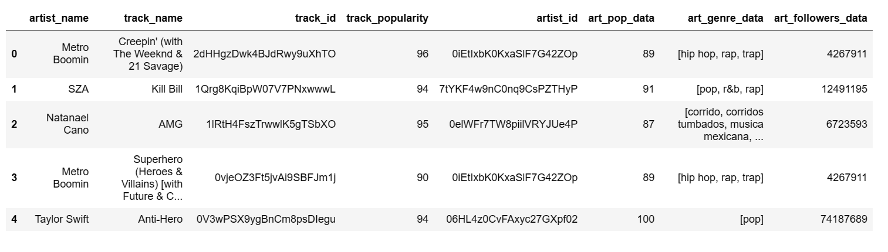

* Initialize empty lists for storing additional artist data.
* Retrieve artist information (popularity, genres, followers) using the Spotify API for each artist in the track_data.
* Extracts artist popularity, genres, and total followers.

```
art_pop_data = []
art_genre_data = []
art_followers_data = []
for a_id in track_data.artist_id:
  artist = sp.artist(a_id)
  art_pop_data.append(artist['popularity'])
  art_genre_data.append(artist['genres'])
  art_followers_data.append(artist['followers']['total'])
```

* Adds the artist-related data (popularity, genres, followers) to the track_data DataFrame.

```
track_data = track_data.assign(art_pop_data=art_pop_data, art_genre_data=art_genre_data, art_followers_data=art_followers_data)
track_data.head()
```

## 4. Create dataframe for all audio features

* Initialize an empty list for storing audio features.
* Use the Spotify API to retrieve audio features for each track in the track_data.
* Append the audio features data to the feature_data list.
* Combine all the feature data into a new DataFrame called data.

```
feature_data = []
for t_id in track_data['track_id']:
  af = sp.audio_features(t_id)
  feature_data.append(af)

data = pd.DataFrame(columns=['danceability', 'energy', 'key', 'loudness', 'mode', 'speechiness', 'acousticness',
                             'instrumentalness', 'liveness', 'valence', 'tempo', 'type', 'id', 'uri',
                             'track_href', 'analysis_url', 'duration_ms', 'time_signature'])

for item in feature_data:
  for feat in item:
    data = pd.concat([data, pd.DataFrame(feat, index=[0])], ignore_index=True)

data.head()
```
* The "feature_data" DataFrame showning some audio features is shown below:

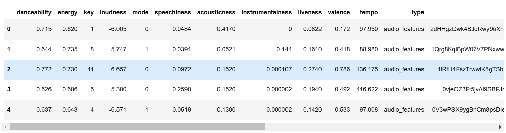

## 5. Data preprocessing - Dropping unnecessary columns

* Drop unnecessary columns from the data DataFrame.
* Print the information (data types, non-null counts) of both track_data and data DataFrames.

```
col_data2 = ['key','mode','type', 'uri','track_href','analysis_url']
data = data.drop(columns=col_data2)
print(track_data.info())
print(data.info())
```
* Data Preprocessing output is shown below:

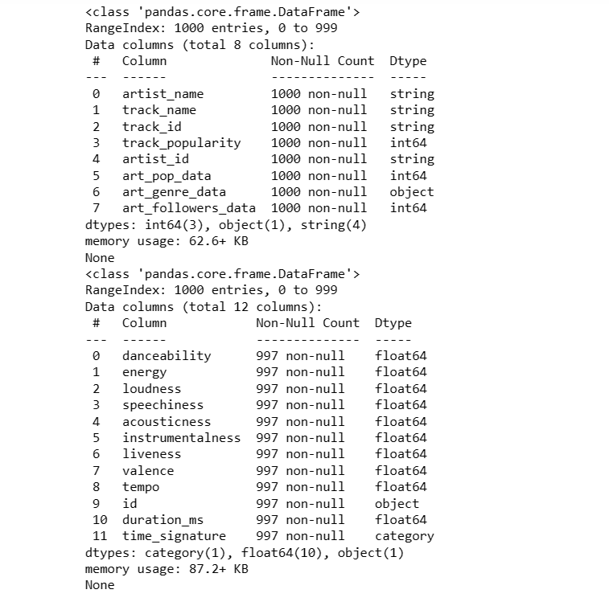

## 6. Datatype modification - convert required data into numeric


* Convert selected columns in the track_data DataFrame to appropriate data types.
* Convert the 'duration_ms', 'instrumentalness', and 'time_signature' columns in the data DataFrame to their respective data types.
* Print information about the updated track_data and data DataFrames.

```
track_data['artist_name'] = track_data['artist_name'].astype("string")
track_data['track_name'] = track_data['track_name'].astype("string")
track_data['track_id'] = track_data['track_id'].astype("string")
track_data['artist_id'] = track_data['artist_id'].astype("string")
data['duration_ms'] = pd.to_numeric(data['duration_ms'])
data['instrumentalness'] = pd.to_numeric(data['instrumentalness'])
data['time_signature'] = data['time_signature'].astype("category")
print(track_data.info())
print(data.info())
```

* Sort the track_data DataFrame by 'track_popularity' column in descending order.
* Display the top 20 tracks based on popularity, including the track name and artist name.

```
track_data.sort_values(by=['track_popularity'], ascending=False)[['track_name', 'artist_name']].head(20)
```
* Data sorting output is shown below:

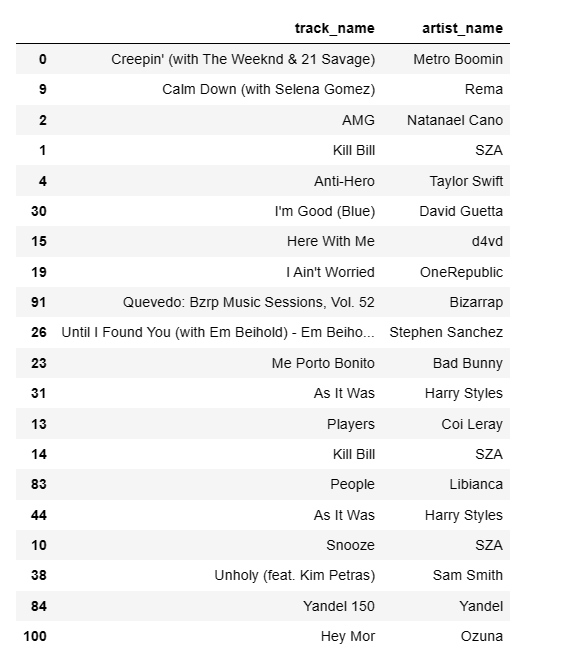

## 7. Sorting data based on artists follower data

* Sort the track_data DataFrame by 'art_followers_data' column in descending order.
* Display the top 20 artists based on followers count, including the artist name, popularity, genre, and followers count.

```
sort_data = pd.DataFrame(track_data.sort_values(by=['art_followers_data'], ascending=False)[['art_followers_data','art_pop_data', 'artist_name','art_genre_data']])
sort_data.astype(str).drop_duplicates().head(20)
```
* Data resorting by artist followers output is shown below:

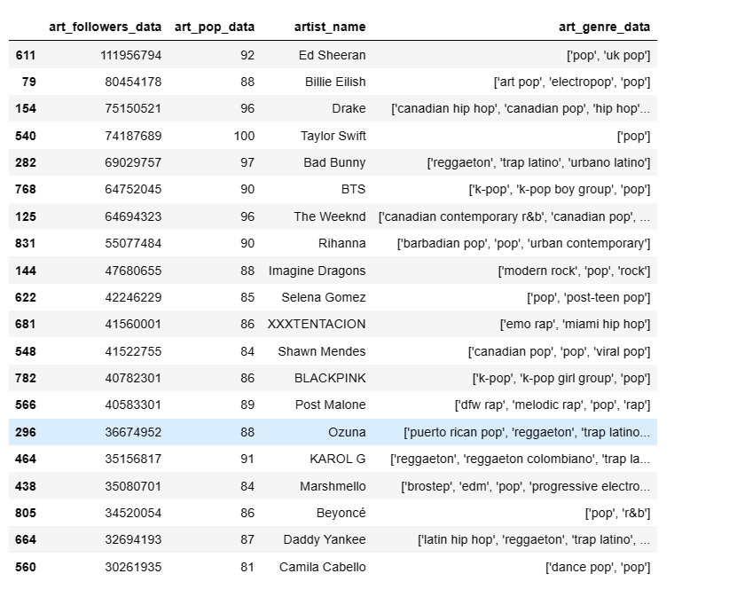

## 8. Create function for genre

* Define a function to convert a Series of lists into a 1D Series.
* Count the occurrences of each genre in the art_genre_data column of track_data.
* Display the top 20 genres and their frequencies.

```
def to_1D(series):
 return pd.Series([x for _list in series for x in _list])
to_1D(track_data['art_genre_data']).value_counts().head(20)
```
* Genre frequency output is shown below:

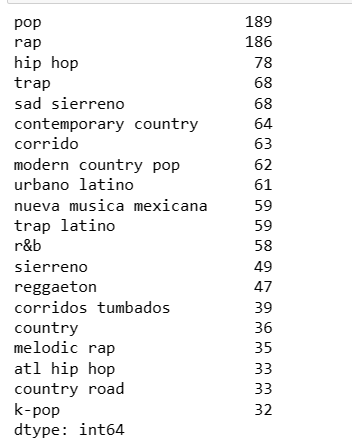

## 9. Data Visualization

* Import the matplotlib.pyplot library.
* Set the number of top genres to display.
* Create a bar plot showing the frequency of the top genres in the track_data DataFrame.

```
import matplotlib.pyplot as plt

# Top N genres to display
top_n = 10
fig, ax = plt.subplots(figsize=(14, 6))
genre_counts = track_data['art_genre_data'].value_counts()[:top_n]
genre_counts.plot(kind='bar', ax=ax, color='green', grid=True)
ax.set_xlabel('Genre', size=12)
ax.set_ylabel('Frequency', size=12)
ax.set_title('Top {} Genres'.format(top_n), size=14)
plt.xticks(rotation=45, ha='right')
ax.legend(['Genre Count'])
plt.tight_layout()
plt.show()
```
* The barplot for Top Genre is shown below:


* Create a bar plot showing the popularity of the top 10 tracks based on their track names and popularity scores.

```
# Bar Plot: Track Popularity

plt.figure(figsize=(12, 6))
plt.bar(track_data['track_name'][:10], track_data['track_popularity'][:10])
plt.xlabel('Track Name')
plt.ylabel('Popularity')
plt.title('Top 10 Tracks by Popularity')
plt.xticks(rotation=45)
plt.show()
```
* The barplot for Track Popularity is shown below:

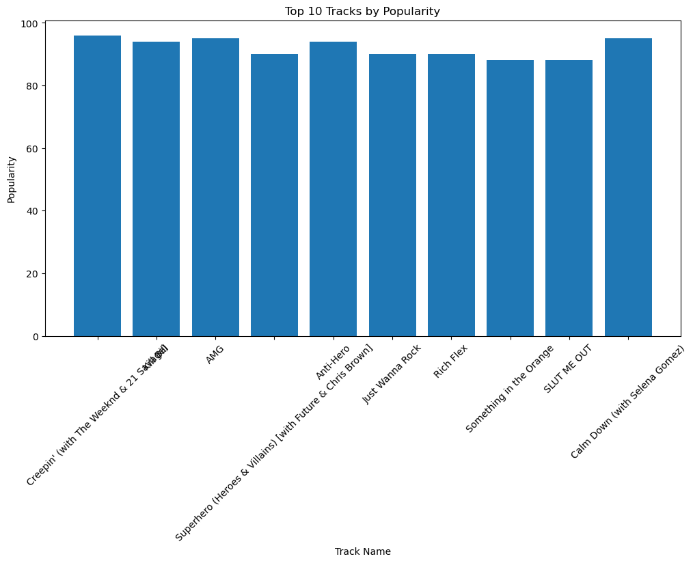


* Import the matplotlib.pyplot library.
* Create a histogram showing the distribution of track popularity scores.
* Add a vertical line representing the mean popularity score.

```
#Histogram: Track Popularity Distribution
import matplotlib.pyplot as plt

# Set up the figure and axes
fig, ax = plt.subplots(figsize=(10, 6))

# Plot the histogram
ax.hist(track_data['track_popularity'], bins=20, edgecolor='black')

# Customize the appearance
ax.set_xlabel('Popularity')
ax.set_ylabel('Frequency')
ax.set_title('Track Popularity Distribution')

# Add gridlines
ax.grid(True, linestyle='--', alpha=0.5)

# Add a vertical line for the mean
mean_popularity = track_data['track_popularity'].mean()
ax.axvline(mean_popularity, color='red', linestyle='--', label='Mean Popularity')
ax.legend()

# Add text annotation for the mean
ax.annotate(f'Mean: {mean_popularity:.2f}', xy=(mean_popularity, ax.get_ylim()[1]),
             xytext=(10, -10), textcoords='offset points', color='red')

# Show the plot
plt.tight_layout()
plt.show()
```
* The Histogram for Track Popularity Distribution is shown below:

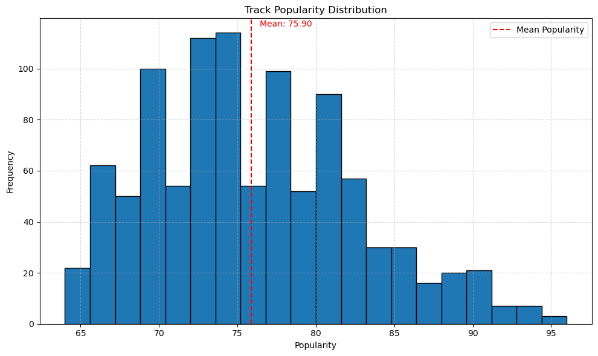


* Create a pie chart showing the distribution of the top genres

```
#Pie chart

top_genres = to_1D(track_data['art_genre_data']).value_counts().head(5)
plt.figure(figsize=(8, 8))
plt.pie(top_genres, labels=top_genres.index, autopct='%1.1f%%', startangle=90)
plt.title('Top Genres')
plt.axis('equal')
plt.show()
```

* The Pie Chart for Top Genre Data is shown below:

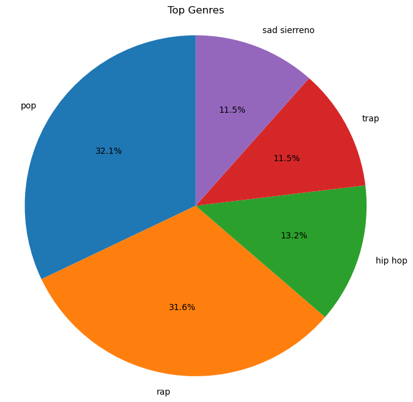


* Create a box plot comparing different audio features (danceability, energy, speechiness, etc.) of the tracks.

```
#Box Plot: Audio Features Comparison
feature_cols = ['danceability', 'energy', 'speechiness', 'acousticness', 'instrumentalness', 'liveness', 'valence']
plt.figure(figsize=(12, 6))
data[feature_cols].boxplot()
plt.title('Audio Features Comparison')
plt.ylabel('Value')
plt.xticks(rotation=45)
plt.show()
```
* The Boxplot for Top audio feature comparison is shown below:

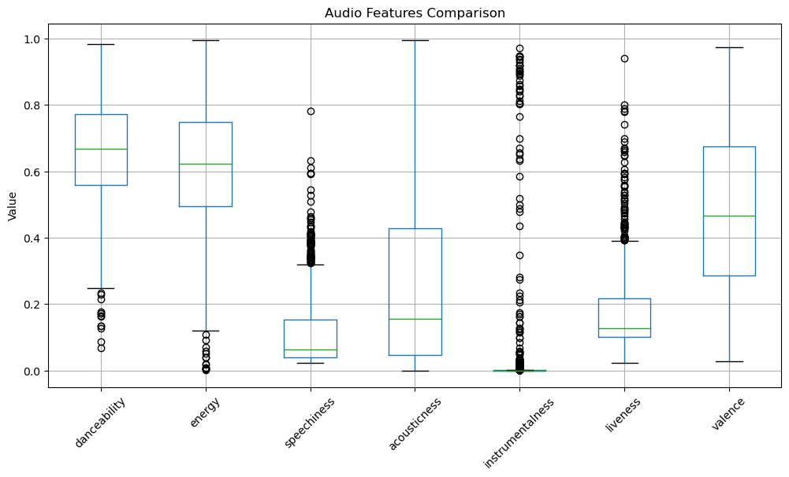

* Import the seaborn library.
* Create a correlation matrix heatmap for the audio features in the data DataFrame.

```
#Heatmap

import seaborn as sns

plt.figure(figsize=(10, 8))
sns.heatmap(data.corr(), annot=True, cmap='coolwarm')
plt.title('Correlation Matrix')
plt.show()
```
* The Heatmap / Correlation Matrix for Audio features is shown below:

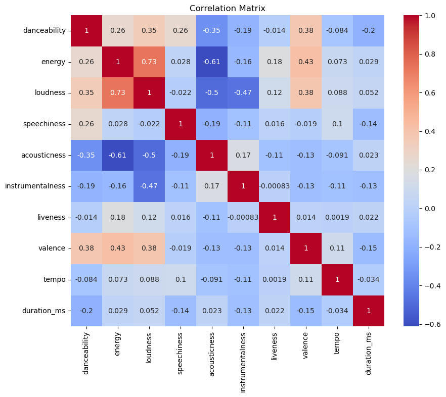

* Extract the top 20 genres. Retrieves the artist name and genre for each genre in top10_genre_data using sort_data DataFrame.
* Convert top_songs_by_genre into a DataFrame using pd.json_normalize().

```
top10_genre_data = list(to_1D(track_data['art_genre_data']).value_counts().index[:20])
art_bygenre_data = []
for genre in top10_genre_data:
  for index, row in sort_data.iterrows():
    if genre in row['art_genre_data']:
      art_bygenre_data.append({'artist_name':row['artist_name'], 'artist_genre':genre})
      break
pd.json_normalize(art_bygenre_data)
```

## 10. Sorting data by track popularity data

* Sort the track_data DataFrame based on track popularity in descending order.
* Display the top 20 tracks by popularity along with their track name, artist name, genre, and track ID

```
by_track_pop = pd.DataFrame(track_data.sort_values(by=['track_popularity'], ascending=False)[['track_popularity','track_name', 'artist_name','art_genre_data', 'track_id']])
by_track_pop.astype(str).drop_duplicates().head(20)
top_songs_by_genre = []
```

* Retrieve the top songs by genre using the top10_genre_data and by_track_pop DataFrames

```
for genre in top10_genre_data:
  for index, row in by_track_pop.iterrows():
    if genre in row['art_genre_data']:
      top_songs_by_genre.append({'track_name':row['track_name'], 'track_popularity':row['track_popularity'],'artist_name':row['artist_name'], 'artist_genre':genre})
      break
pd.json_normalize(top_songs_by_genre)
```

* Import the seaborn library.
* Create a bar plot showing the track popularity for each genre using the top_songs_by_genre DataFrame.

```
import seaborn as sns

# Create a DataFrame for plotting
df = pd.DataFrame(top_songs_by_genre)

# Plot the data
plt.figure(figsize=(10, 6))
sns.barplot(data=df, x='artist_genre', y='track_popularity')
plt.xlabel('Genre')
plt.ylabel('Track Popularity')
plt.title('Top Songs by Genre')
plt.xticks(rotation=45)
plt.tight_layout()
plt.show()
```
* The Barplot for Top songs by Genre is shown below:

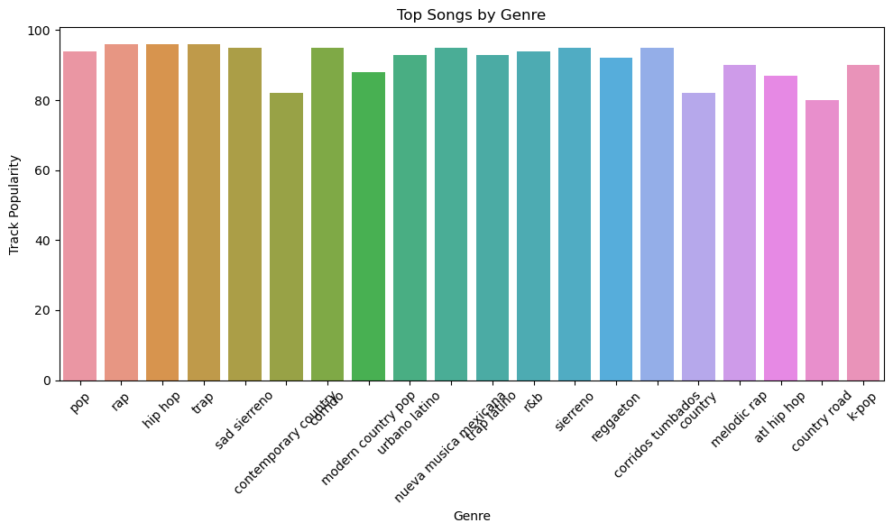


* Calculate total track popularity for each genre by iterating over a list of songs categorized by genre.
* Store the genre and its corresponding popularity in a dictionary called genre_popularity.
* Prepare the data for a pie chart by creating separate lists for genres and their respective popularities.
* Create and display a pie chart showing the distribution of track popularity among different genres.
```
import matplotlib.pyplot as plt

# Calculate the total track popularity for each genre
genre_popularity = {}
for song in top_songs_by_genre:
    genre = song['artist_genre']
    popularity = song['track_popularity']
    genre_popularity[genre] = genre_popularity.get(genre, 0) + popularity
    
# Prepare the data for the pie chart
genres = list(genre_popularity.keys())
popularity = list(genre_popularity.values())

# Plot the pie chart
plt.figure(figsize=(8, 8))
plt.pie(popularity, labels=genres, autopct='%1.1f%%')
plt.title('Track Popularity by Genre')
plt.axis('equal')
plt.show()
```

* The Pie Chart for Track Popularity by Genre is shown below:

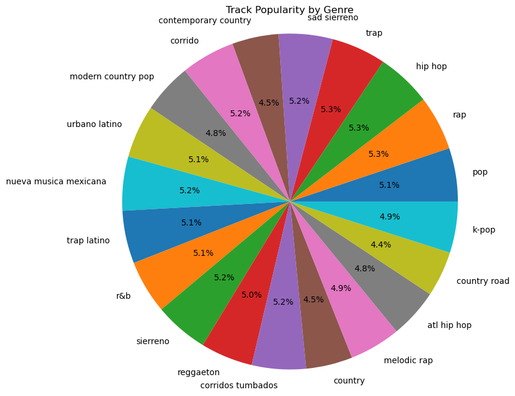

## 11. Select important audio features on which recommendation function is build


* Retrieve the audio feature data (danceability, energy, speechiness, acousticness, liveness) for the top 100 tracks in by_track_pop.
* Create a new DataFrame named top_100_feat to store the extracted audio feature information.
* Display the first few rows of the top_100_feat DataFrame.

```
col_feat_data = ['danceability', 'energy', 'speechiness', 'acousticness', 'liveness']
top_100_feat = pd.DataFrame(columns=col_feat_data)

for i, track in by_track_pop[:100].iterrows():
  features = data[data['id'] == track['track_id']]
  top_100_feat = pd.concat([top_100_feat, features[col_feat_data]], ignore_index=True)

top_100_feat.head()
```

## 12. Top 100 songs recommendation based on top genre

* Use the Spotify API to get recommendations based on seed artists, genres, and tracks.
* Print the artists and track names from the recommendation results.

```
recommendation_data = sp.recommendations(seed_artists=["3PhoLpVuITZKcymswpck5b"], seed_genres=["pop"], seed_tracks=["1r9xUipOqoNwggBpENDsvJ"], limit=100)
for track in recommendation_data['tracks']:
  print(track['artists'][0]['name'], track['name'])
```


## How to Run the Code

* Ensure that you have registered for the Spotify API key. 
* To retrieve the Key you should follow the following steps:
* Login into the Spotify Developers page and create a new project.
* Navigate to the settings of that particular project and it will display the required API Keys.


* Ensure that you have installed necessary Python packages.
* Open a new kernel in Jupyter notebook.
* Navigate to the directory where  PFA_PROJECT_SPOTIFY API.py is saved in your system.
* Run the Python script provided.


## Results from your Analysis

Our Major Results were as follows:


* Artist data by top 10 genre: Each row in the DataFrame represents an artist and their corresponding genre (Top 10 genre)

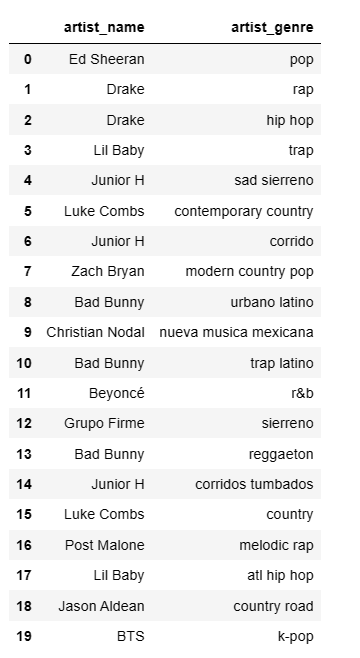


* Tracks by top 10 genre: 

The resulting DataFrame will have the following columns:

'track_name': The name of the track.
'track_popularity': The popularity score of the track.
'artist_name': The name of the artist associated with the track.
'artist_genre': The genre of the artist.

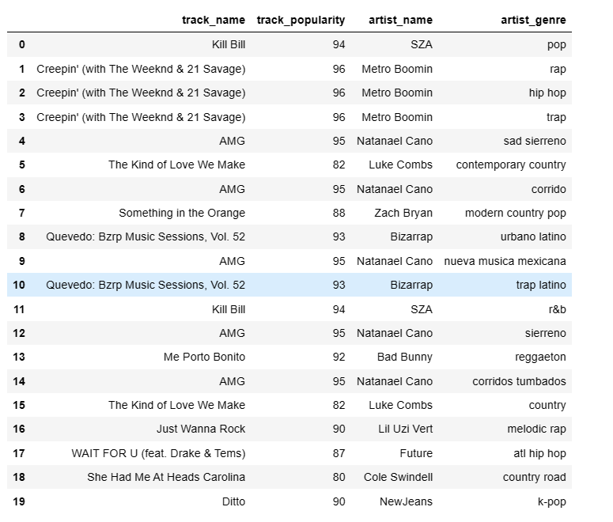

Each row in the DataFrame represents a top song for a particular genre. The code iterates through the top10_genre_data list and checks if each genre exists in the 'art_genre_data' column of the by_track_pop DataFrame. If a match is found, a dictionary with the relevant information (track name, track popularity, artist name, and genre) is appended to the top_songs_by_genre list.


* Sample Recommendations: 

The output of the code will be a list of artist names and corresponding track names for the recommended tracks. The number of printed lines will depend on the number of tracks returned by the Spotify API, which is limited to 100

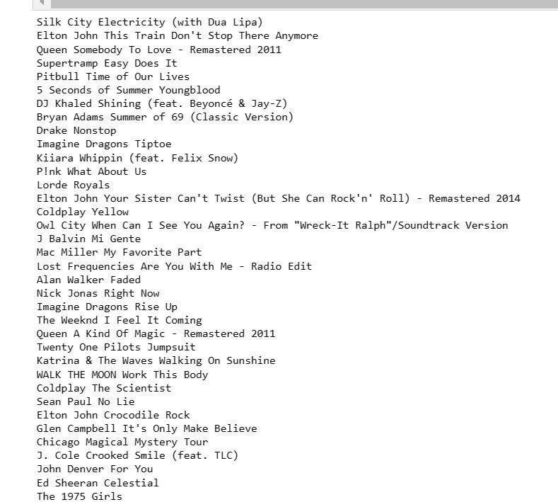


## Potential Areas for Future Improvement

* The current project provides a basic foundation for exploring and analyzing music data from Spotify. Here are some potential future enhancements and extensions for this project:

* Build a recommendation system that suggests songs based on user preferences, such as favorite genres, artists, or tracks. This can be achieved by implementing collaborative filtering algorithms or content-based filtering techniques.

* Explore time series analysis to identify trends and patterns in music popularity over time. This can involve analyzing seasonal trends, identifying rising or declining genres, or predicting future music trends.

* Develop a genre classification model using machine learning techniques to automatically classify songs into different genres. This can improve the accuracy of genre-related analysis and recommendations.

* Integrate the project with social media platforms to gather data about users' music preferences, such as their Spotify playlists, liked songs, or music-related posts. This data can be used to enhance recommendations and provide more personalized insights.

* Integrate the project with other music-related APIs or services, such as lyrics APIs, concert ticketing services, or music streaming platforms, to provide additional functionalities and enrich the user experience.
